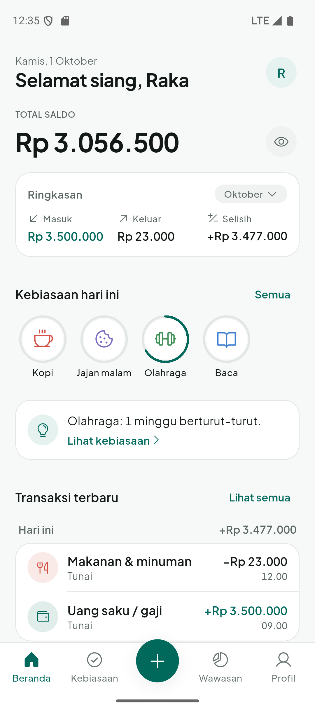
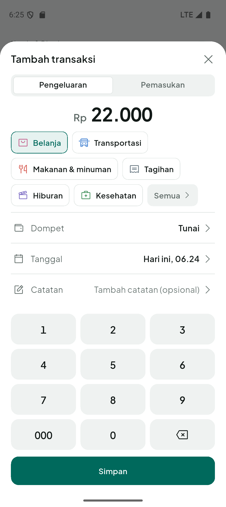
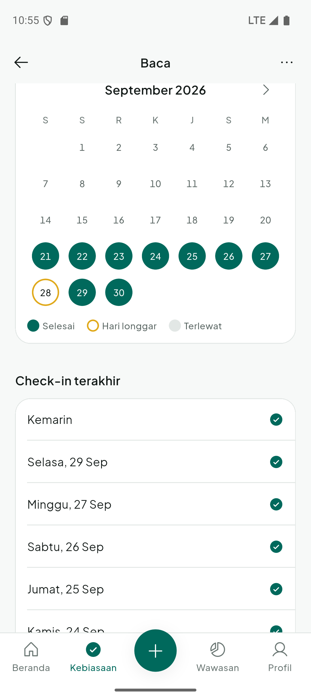
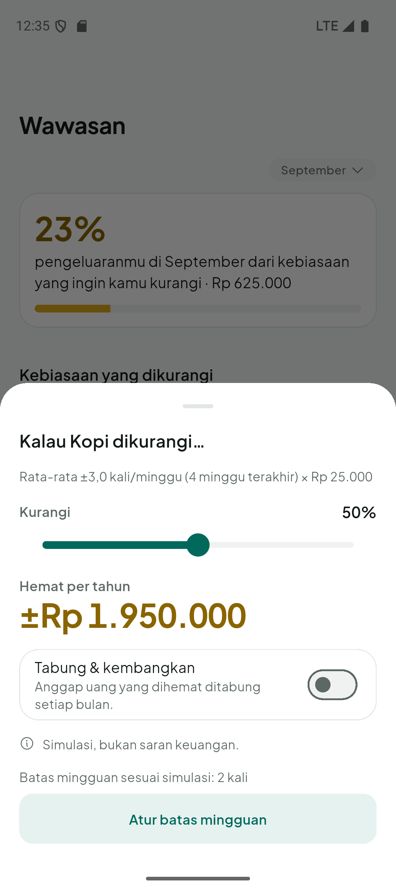

<div align="center">
  
  <h1>CompoundMe</h1>
  <p><i>See what your small habits really cost, and build the ones that matter.</i></p>
</div>

CompoundMe is a personal finance and habit tracker for Android, written in Flutter. It logs money like any expense tracker, and adds one idea: habits are tied to money. A habit you want to **reduce** (the daily coffee) has a price, so every check-in becomes an expense and the app can show what that habit costs per month and per year. A habit you want to **build** (reading, working out) is tracked with a streak that forgives one missed day.

Everything is stored on the phone. There is no account, no server and no analytics.

> **Status:** version 2.0.0, a full rebuild of the v1 prototype. It runs on Android 8.0+ (tested on a Pixel 9 emulator, API 35). It has not been tested on real devices yet, and iOS builds are not published or tested. There is no Web version.

## Screenshots

<table>
  <tr>
    <td align="center"><br/><sub>Home</sub></td>
    <td align="center"><br/><sub>Log an expense in a few taps</sub></td>
    <td align="center"><br/><sub>Habit calendar with a grace day</sub></td>
  </tr>
  <tr>
    <td align="center"><br/><sub>Compound Insights</sub></td>
    <td align="center"><br/><sub>What if I cut it by half?</sub></td>
    <td align="center"><br/><sub>Dark mode</sub></td>
  </tr>
</table>

Short screen recordings: [logging an expense](docs/v2/media/flow-b-catat-kopi.mp4) and [checking in a habit](docs/v2/media/checkin-kebiasaan.mp4).

## What it does

- **Wallets and categories.** Several wallets (cash, bank, e-wallet); the balance is always computed from the transactions, never stored. Default and custom categories with icons and colors.
- **Fast logging.** An amount keypad in a bottom sheet remembers the last category and wallet. Deleting or editing can be undone from a snackbar instead of a confirmation dialog.
- **History.** Month by month, with search across all months and filters by category and wallet.
- **Habits, build and reduce.** Daily, chosen weekdays, or N times a week. One tap checks in; long-press sets a count. A reduce habit has a cost, a wallet and a category, and each check-in creates the matching expense (and undoing it removes it).
- **A friendly streak.** The "never miss twice" rule: one missed day per seven scheduled days is a *grace day* and does not break the streak. Weeks that are still running are never counted as failed.
- **Compound Insights.** How much of the month's spending comes from reduce habits, the yearly cost of each at the current pace, consistency and trend for build habits, a spending donut that opens the filtered history, and a simulator: cut a habit by 0–100 %, optionally save the difference with monthly compound interest for 1, 3 and 5 years. It is labelled as a simulation, not financial advice.
- **Private by design.** Works fully offline. Balances can be hidden at launch. "Delete all data" asks twice.
- **Two languages and two themes.** Indonesian and English, light and dark, switched at runtime.
- **Accessible.** Touch targets of at least 48 dp, labels for every icon button, amounts spelled out for screen readers, layouts that hold up at 130 % text size on a 360 dp wide phone.

## Architecture

```
lib/
  core/            design system (tokens, components), database, l10n, router, utils
  features/<name>/ data/ (Drift repositories)  domain/ (pure Dart)  presentation/ (screens, providers)
```

- **State and navigation:** Riverpod 3 with code generation, `go_router` with a tab shell.
- **Storage:** Drift on SQLite, schema version 3 with a migration test against stored schema snapshots. IDs are UUIDs, tables have `updatedAt` and soft deletes, which keeps a future sync possible.
- **Money is an `int` of Rupiah.** One formatter (`formatRupiah`); no floating point for money.
- **Domain code is plain Dart and unit tested:** streaks with grace days, schedules, the insights formulas, the compound interest projection (checked against a hand-computed value).
- **Consistency by construction:** a single writer (`HabitLedger`) keeps habit logs and their check-in expenses in step inside one database transaction, and double taps are collapsed.
- **Design system in code.** Colors, text sizes, spacing, radius and durations come from `lib/core/design` only; a test fails the build if a screen uses a literal value, a gradient or an emoji.
- **Strings** go through `gen-l10n` with Indonesian and English files that must stay in sync (also enforced by a test).

The specification lives in [`compound_me/docs/v2/`](compound_me/docs/v2/README.md): product requirements, design system, screens and flows, architecture, the execution plan with its decision log, and the [phase 6 audit](compound_me/docs/v2/07-audit-fase-6.md).

## Build and run

Requirements: Flutter 3.47 or newer (Dart 3.13), Android SDK, an emulator or a device.

```sh
cd compound_me
flutter pub get
dart run build_runner build --delete-conflicting-outputs
flutter gen-l10n
flutter run
```

Checks, as run in CI on every pull request:

```sh
flutter analyze    # 0 issues
flutter test       # unit, widget, audit tests
```

Release build: keep your upload keystore outside the repository, create `compound_me/android/key.properties` (git-ignored) with `storePassword`, `keyPassword`, `keyAlias` and `storeFile`, then run `flutter build apk --release`. Without that file the release build falls back to the debug key.

The debug build adds a row in Settings that fills in 60 days of sample data to explore Insights. It is compiled out of release builds.

## Quality

- 350+ unit and widget tests, including audits over every screen in both languages at 130 % text size.
- Each development phase had a checklist that ran on an emulator through integration tests (`compound_me/integration_test/`) and `adb` scripts (`compound_me/tool/qa/`).
- Performance, measured on an emulator in profile mode: cold start to the first frame about 1.4 s with 1,000 transactions stored; scrolling a 1,000-transaction history costs about 0.4 ms of UI-thread work per frame. Rendering time on an emulator is dominated by its GPU bridge, so a real-device check is still open.
- The release APK is R8-minified, smoke-tested, and passes the Android 16 KB page size checks (`zipalign -P 16`, ELF segment alignment).

## Known limits

No export or backup yet, no reminders, budgets, goals or transfers between wallets (planned for 2.1). Data from the v1 prototype is not migrated. Real-device checks (TalkBack, haptics, feel) are listed in the execution plan under manual QA.

## Author

Hisyam Khaeru Umam ([@Umeem26](https://github.com/Umeem26)). The fonts (Plus Jakarta Sans, OFL) and icons (Phosphor, MIT) are bundled with their licenses, shown in the app under Profile, About, Open source licenses.
