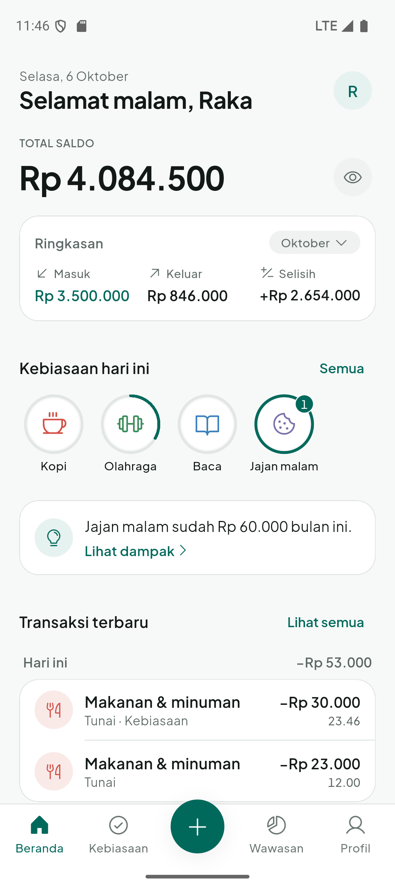
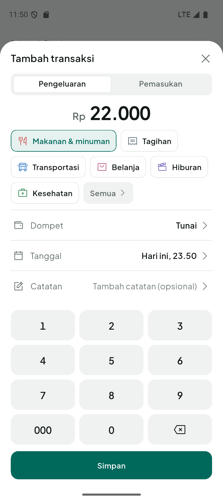
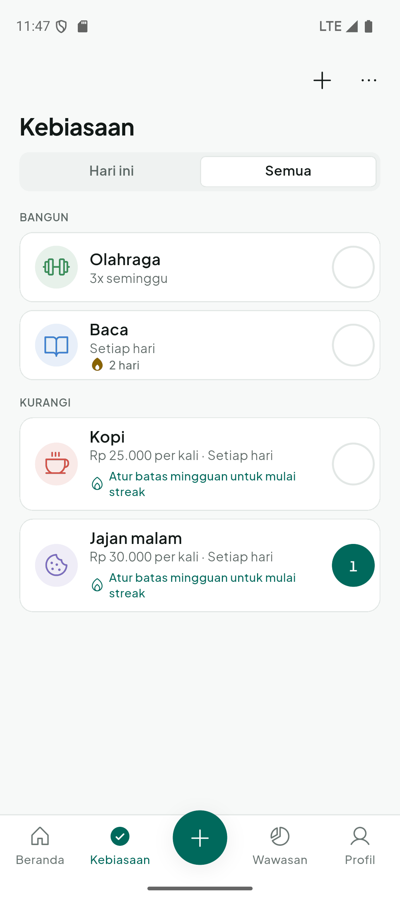
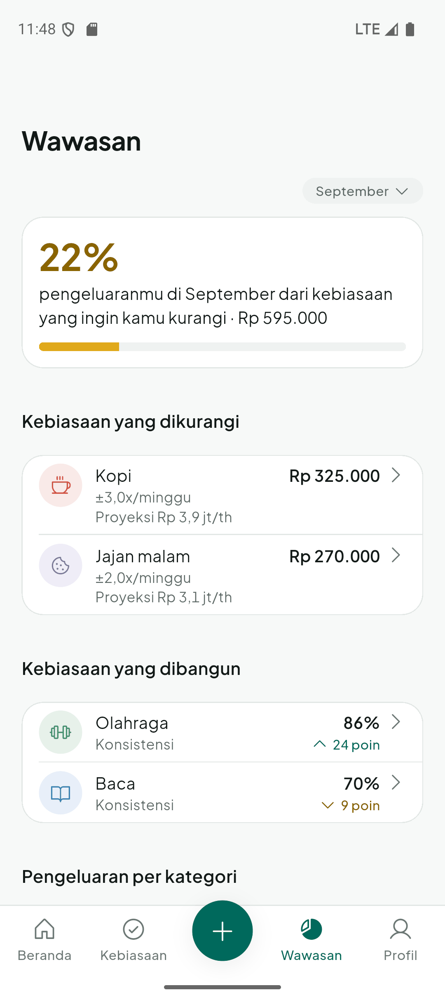
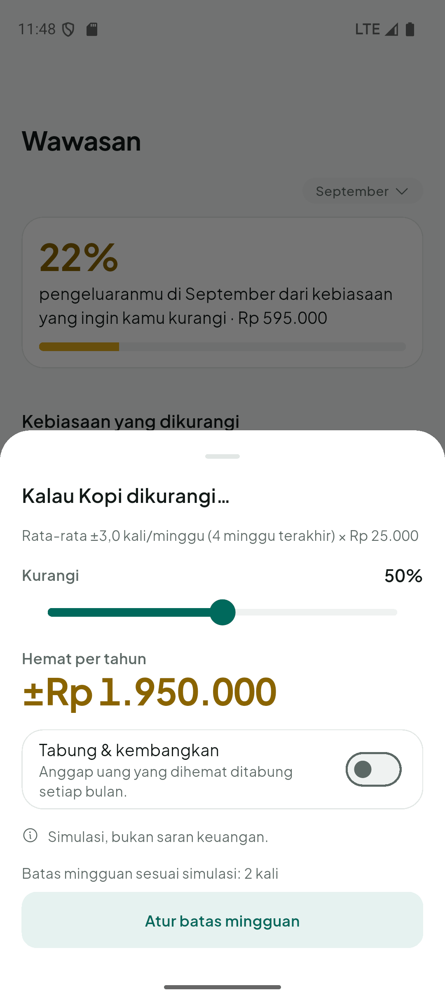
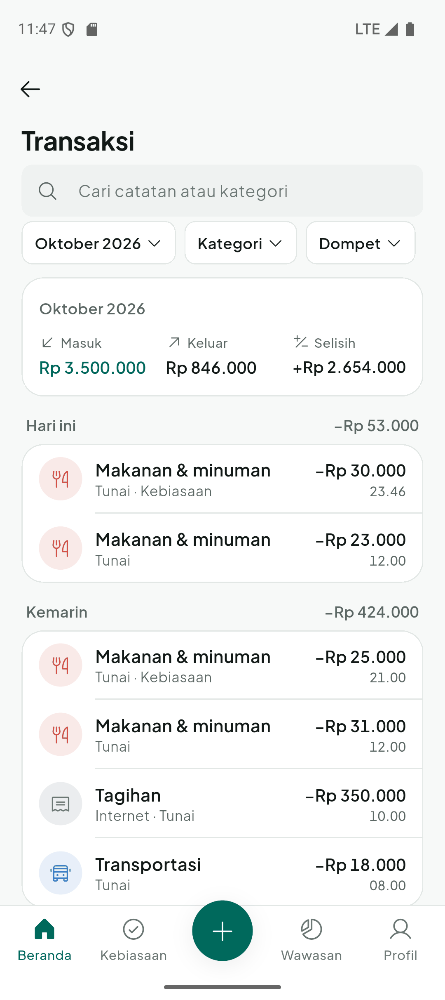
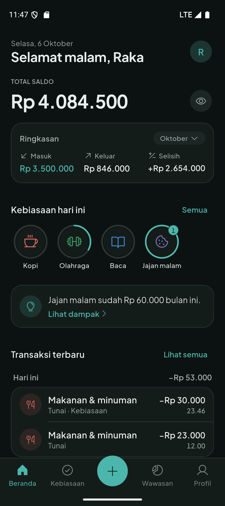
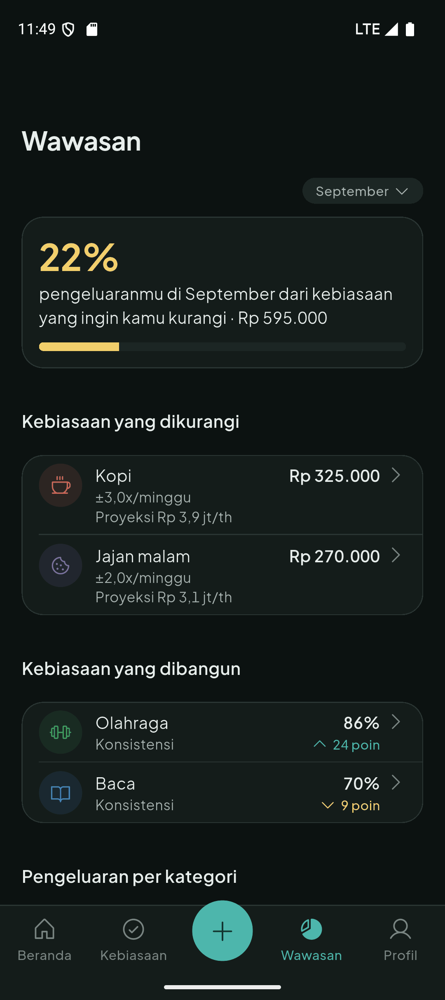
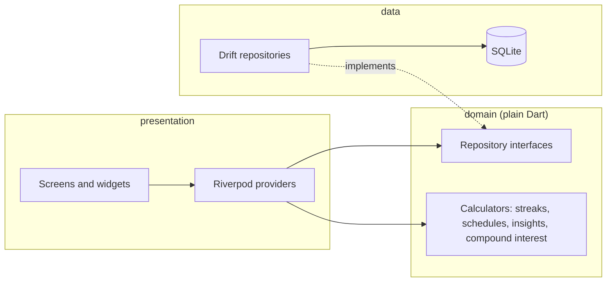

# CompoundMe

**A local-first Android app that tracks your money and your habits together, so you can see what a small daily habit really costs.**

[](https://github.com/Umeem26/Compound_Me/actions/workflows/ci.yml)
[](https://github.com/Umeem26/Compound_Me/releases/latest)
[](LICENSE)
[](https://flutter.dev)

<p>
  
  
  
  
  
  
  
  
</p>

Two short screen recordings: [logging an expense](docs/media/flow-b-catat-kopi.mp4) and [checking in a habit](docs/media/checkin-kebiasaan.mp4). The screenshots use generated sample data (a debug-only tool), not real money.

## What it does

- **Wallets and categories.** Cash, bank and e-wallet wallets with a balance computed from the transactions; default and custom categories.
- **Fast logging.** An amount keypad in a bottom sheet remembers your last category and wallet. Deleting or editing is undone from a snackbar instead of a confirmation dialog.
- **History.** Month by month, search across all months, filters by category and wallet.
- **Two kinds of habits.** *Build* habits (reading, working out) and *reduce* habits (the daily coffee). A reduce habit has a price, a wallet and a category: each check-in creates the matching expense, and undoing it removes it. Schedules are daily, chosen weekdays or N times a week; long-press sets a count for reduce habits.
- **A forgiving streak.** One missed day per seven scheduled days is a grace day and does not break the streak. A week still in progress is never counted as failed.
- **Compound Insights.** The share of the month's spending that comes from reduce habits, the yearly cost of each at your current pace, consistency and trend for build habits, a category donut that opens the filtered history, and a simulator: cut a habit by 0-100 %, optionally save the difference with monthly compound interest for 1, 3 and 5 years. It is labelled a simulation, not financial advice.
- **Private.** No account, no server, no analytics; works fully offline. Optionally hide balances at launch. "Delete all data" asks twice.
- **Indonesian and English**, light and dark theme, switched at runtime.
- **Accessibility.** 48 dp touch targets, a label on every action, amounts spelled out for screen readers, layouts checked at 130 % text size on a 360 dp wide phone.

## How it's built



```
lib/
  core/              design system (tokens, components), database, l10n, router, utils
  features/<name>/   data/  domain/  presentation/
```

- **Flutter 3.47 / Dart 3.13**, Riverpod 3 with code generation, `go_router`, Drift on SQLite (schema version 3, with a migration test against stored schema snapshots), `fl_chart`.
- **Money is an `int` of Rupiah**, formatted in one place. No floating point for money.
- **Balances are computed from transactions, never stored**, so they cannot drift out of sync.
- **Soft deletes, UUIDs and `updatedAt` on every table**, which keeps a future sync possible. There is no sync today.
- **Local-first**, no account. Repositories sit behind interfaces; widgets never touch the database.
- **One writer for habit check-ins** (`HabitLedger`) keeps habit logs and their expenses consistent inside a single database transaction; double taps are collapsed.
- **A design system enforced by tests.** Colors, text sizes, spacing, radius and durations come only from `lib/core/design`; a test fails if a screen uses a literal value, a gradient or an emoji.
- **Bilingual** through `gen-l10n`, with Indonesian and English files that must stay in sync (also a test).

The specification (written in Indonesian) is in [`docs/`](docs/README.md): requirements, design system, screens and flows, architecture, and the execution plan with its decision log.

## Quality

Numbers from the latest run on `main`:

- `flutter analyze`: 0 issues. `flutter test`: **353 tests** pass.
- Line coverage: **92 %** overall and **98 %** in `domain/` code (7,561 and 432 executable lines of the files the tests load, from `flutter test --coverage`).
- CI (analyze, format check, tests, debug APK) runs on every pull request and push to `main`.
- Audit tests cover every screen in both languages at 130 % text size, unnamed actions for screen readers, and error states.
- Each development phase ran a checklist on an emulator (integration tests and `adb` scripts in [`integration_test/`](integration_test/) and [`tool/qa/`](tool/qa/README.md)); results are in the closed pull requests.
- Measured on an emulator in profile mode: cold start to first frame about 1.4 s with 1,000 transactions stored; scrolling that history costs about 0.4 ms of UI-thread work per frame. Raster time on an emulator is dominated by its GPU bridge, so it says little about real hardware.
- The release APK is R8-minified, signed with a dedicated upload key, and passes the Android 16 KB page size checks. Details in the [phase 6 audit](docs/engineering/07-audit-fase-6.md).

## Install

Android 8.0 (API 26) or newer. Download `CompoundMe-v2.0.0.apk` from the [latest release](https://github.com/Umeem26/Compound_Me/releases/latest), open it on the phone and allow installs from your browser or file manager when Android asks. Check the SHA-256 in the release notes if you like. Uninstall the v1 prototype first: v2 uses a different signing key and does not migrate v1 data.

## Build from source

Requirements: Flutter 3.47.5 (the version CI uses), Android SDK, an emulator or a device.

```sh
flutter pub get
dart run build_runner build --delete-conflicting-outputs
flutter gen-l10n
flutter run
flutter analyze && flutter test
```

For a release build, keep your upload keystore outside the repository and create `android/key.properties` (git-ignored) with `storePassword`, `keyPassword`, `keyAlias` and `storeFile`; then `flutter build apk --release`. Without that file the release build falls back to the debug key. Debug builds add a Settings row that fills in 60 days of sample data; it is compiled out of release builds.

## Roadmap

Planned for 2.1, not started: reminders, budgets, savings goals, transfers between wallets, and export/backup. Cloud sync is only prepared for in the data model (UUIDs, `updatedAt`, soft deletes); it does not exist.

## Limitations

- Android only. The project contains the iOS runner, but iOS is not built, tested or published. There is no web version.
- Tested on a Pixel 9 emulator (API 35) and in widget tests; not yet on real devices. TalkBack, haptics and real scrolling feel are open items in the [manual QA list](docs/process/06-execution-plan.md).
- No data export or backup yet; data lives only on the phone. Data from the v1 prototype is not migrated.
- Insights need about a week of data before they show anything.

## License

[MIT](LICENSE), copyright Hisyam Khaeru Umam. Bundled fonts (Plus Jakarta Sans, OFL) and icons (Phosphor, MIT) keep their own licenses, listed in the app under Profile, About.

## Contact

[@Umeem26](https://github.com/Umeem26) on GitHub.
